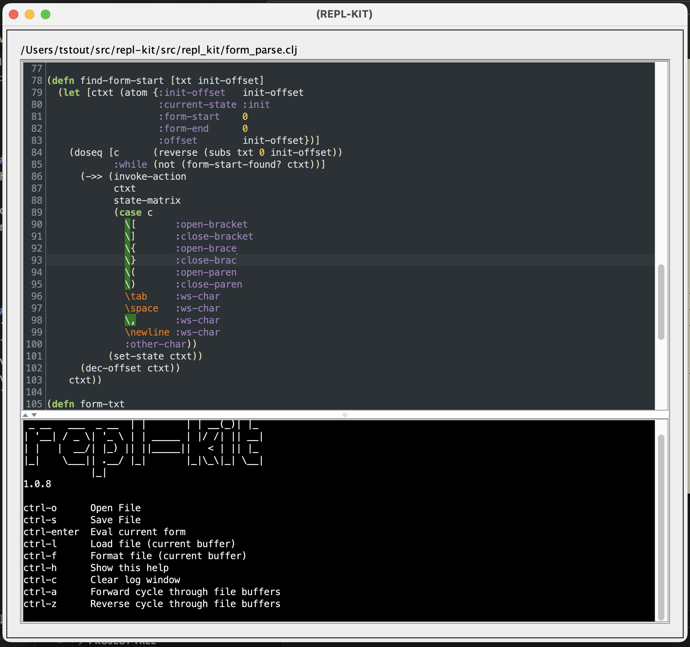

# repl-kit

A minimal clojure editor with REPL integration



## Motivation
This is not a replacment for great REPL editor tools such as cider and calva. Frequently I need to work in restricted environments where I cannot install those tools. I also need something that is self-contained and published to maven central, again due to restricted environments.

## deps.edn maven coordinates
```
com.github.tstout/repl-kit {:mvn/version "1.0.10"}
```
## Usage
Add this to your deps.edn aliases map:
```
:repl   {:extra-deps  {com.github.tstout/repl-kit  {:mvn/version "1.0.10"}
                                  org.clojure/tools.namespace {:mvn/version "1.5.0"}}
                    :extra-paths ["dev"]
                    :main-opts   ["-m" "repl-kit.core"]}

```

The editor can then be started with 
```
clojure -M:repl
```
## TODOs
- Make repl listen port configurable
- remove spurious ns in from execution results
- support connecting to remote JVM (should be minor change)
- Remove some commented code, add comments where warranted

## Publishing to Maven Central (Note to Self)
```bash
clojure -T:build uberjar
mvn package
mvn deploy
```


# TODOs